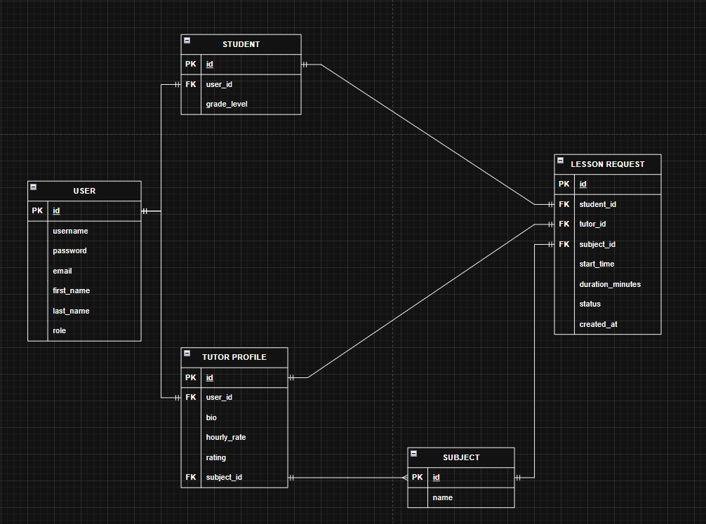
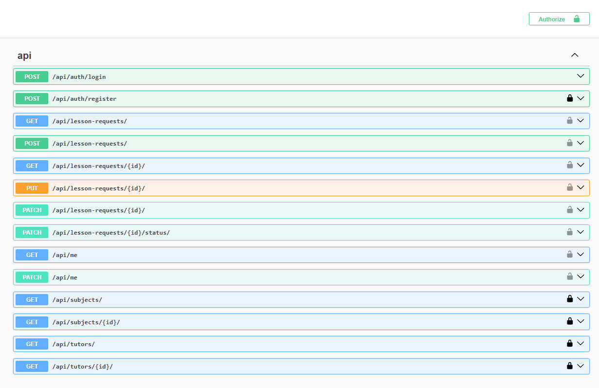

# Pi Course – Backend (Django + DRF)

**Pi Course**, öğrencilerin eğitmenleri bulup ders talebi oluşturabildiği bir mini MVP uygulamasıdır.  
Bu repo, projenin **Django + DRF** tabanlı backend servislerini içerir.  
Frontend (Flutter) projesi için [pi_course_mobile](https://github.com/fuldenozsayin/pi_course_mobile) reposuna bakabilirsiniz.

---

## 📌 İçindekiler
- [Proje Özeti](#proje-özeti)
- [Mimari Notlar](#mimari-notlar)
- [Veri Modeli](#veri-modeli)
- [Swagger/OpenAPI](#swaggeropenapi)
- [Repo Yapısı](#repo-yapısı)
- [Kurulum](#kurulum)
- [API Uç Noktaları](#api-uç-noktaları)
- [API Örnekleri](#api-örnekleri)
- [Örnek Demo Hesaplar](#örnek-demo-hesaplar)
- [Test Çalıştırma](#test-çalıştırma)
- [Kullanılan Ek Kütüphaneler](#kullanılan-ek-kütüphaneler)
- [Artı Puanlar](#artı-puanlar)
- [Kalanlar--Trade-offs](#kalanlar--trade-offs)

---

## Proje Özeti
Backend, şu ana akışları destekler:
- **Kayıt & Giriş** (JWT ile)
- **Profil Yönetimi** (`GET/PATCH /api/me`)
- **Ders Konusu (Subject)** listeleme
- **Eğitmen Listesi** filtreleme, arama ve sıralama ile
- **Ders Talebi (LessonRequest)** oluşturma, görüntüleme, onaylama/reddetme
- **Rol Bazlı İzinler** (Student talep açar, Tutor onaylar/reddeder)
- **Rate Limiting** (talep oluşturma sınırı)

---

## Mimari Notlar
- **Katmanlı yapı**: `models`, `serializers`, `views`, `permissions`, `querysets`
- **Rol bazlı izinler**: `core/permissions.py` üzerinden
- **Performans optimizasyonu**: `select_related` & `prefetch_related` ile N+1 sorgu önleme
- **Seed komutu**: `python manage.py seed_demo` ile örnek veri ekleme
- **Swagger/OpenAPI**: `drf-spectacular` ile `/api/docs` altında  
- **Throttling**: `LessonRequestThrottle` ile kullanıcı başına saatlik talep limiti

---

## Veri Modeli
Proje için kullanılan veri modeli şeması:
- **User (AbstractUser’dan):** role = student | tutor
- **Subject:** name
- **TutorProfile:** user (OneToOne), bio, hourly_rate, rating (0–5), subjects (M2M Subject)
- **StudentProfile:** user (OneToOne), grade_level (str | optional)
- **LessonRequest:** student (FK User), tutor (FK User), subject (FK Subject), start_time
 (DateTime, ISO8601 UTC),duration_minutes (int), status: pending | approved
 | rejected, created_at



---

## Swagger/OpenAPI
Projenin API dokümantasyonu **drf-spectacular** kullanılarak otomatik olarak oluşturulmuştur.  
Tüm endpoint’leri test etmek için `/api/docs` adresine gidin.



---

## Repo Yapısı
Bu proje **iki ayrı repo** olarak yapılandırılmıştır:
- **Backend** (Django + DRF) → [pi-course-backend](https://github.com/fuldenozsayin/pi-course-backend)
- **Mobil** (Flutter) → [pi_course_mobile](https://github.com/fuldenozsayin/pi_course_mobile)

### Neden İki Repo?
- **Bağımsız geliştirme**: Backend ve mobil ekipleri bağımsız çalışabilir.
- **Sürüm kontrolü**: API ve mobil uygulama sürümleri ayrı tutulur.
- **Deploy kolaylığı**: Backend deploy süreci mobil paketleme sürecinden etkilenmez.
- **Temiz commit geçmişi**: Kod inceleme süreçleri sadeleşir.
- **Test ve CI/CD ayrımı**: Her repo kendi pipeline’ına sahip olur.

---

## Kurulum
```bash
git clone https://github.com/fuldenozsayin/pi-course-backend.git
cd pi-course-backend
python -m venv .venv
source .venv/bin/activate  # Windows: .venv\Scripts\activate
pip install -r requirements.txt
python manage.py migrate
python manage.py seed_demo
python manage.py runserver
```

---

## API Uç Noktaları
| Metod | URL | Açıklama |
|-------|-----|----------|
| POST | `/api/auth/register` | Kayıt ol (student/tutor) |
| POST | `/api/auth/login` | JWT ile giriş |
| GET  | `/api/me` | Mevcut kullanıcı profili |
| PATCH| `/api/me` | Profil güncelle |
| GET  | `/api/subjects` | Konu listesi |
| GET  | `/api/tutors` | Eğitmen listesi |
| GET  | `/api/tutors/{id}` | Eğitmen detayı |
| POST | `/api/lesson-requests` | Yeni ders talebi |
| GET  | `/api/lesson-requests` | Kullanıcının ders talepleri |
| PATCH| `/api/lesson-requests/{id}` | Talebi onayla/ret et |

---

## API Örnekleri
### Kayıt
```http
POST /api/auth/register
{
  "email": "student@demo.com",
  "password": "Passw0rd!",
  "role": "student"
}
```
### Giriş (JWT)
```http
POST /api/auth/login
{
  "email": "student@demo.com",
  "password": "Passw0rd!"
}
```
**Response**
```json
{
  "access": "<jwt_access_token>",
  "refresh": "<jwt_refresh_token>"
}
```
### Eğitmen Listesi
```http
GET /api/tutors?subject=2&ordering=-rating&search=physics
Authorization: Bearer <access_token>
```
**Response**
```json
{
  "count": 2,
  "results": [
    {
      "id": 5,
      "name": "Dr. Ayşe Demir",
      "subjects": [{ "id": 2, "name": "Physics" }],
      "hourly_rate": 500,
      "rating": 4.8,
      "bio": "ODTÜ fizik doktora ..."
    }
  ]
}
```
### Ders Talebi Oluşturma (Student)
```http
POST /api/lesson-requests
Authorization: Bearer <access_token>
{
  "tutor_id": 5,
  "subject_id": 2,
  "start_time": "2025-08-15T10:00:00Z",
  "duration_minutes": 60,
  "note": "Kuantum girişi"
}
```
### Talebi Onaylama (Tutor)
```http
PATCH /api/lesson-requests/12
Authorization: Bearer <access_token>
{
  "status": "approved"
}
```

---

## Örnek Demo Hesaplar
| Rol | Email | Şifre |
|-----|-------|-------|
| Student | student@demo.com | Passw0rd! |
| Tutor | tutor@demo.com | Passw0rd! |

---

## Test Çalıştırma
```bash
python manage.py test -v 2
```
> Not: Bazı testler çalışmıyor; detay için Kalanlar/Trade-offs bölümüne bakın.

---

## Kullanılan Ek Kütüphaneler
- Django Rest Framework (DRF)
- drf-spectacular
- djangorestframework-simplejwt
- django-filter
- pytest
- sqlite3

---

## Artı Puanlar
- ✅ API dokümantasyonu
- ✅ Rate Limiting
- ✅ select_related / prefetch_related
- ✅ Seed komutu
- ⏳ CI (GitHub Actions) planlandı
- ⏳ Docker Compose planlandı

---

## Kalanlar / Trade-offs
- **Testler**: Bazı senaryolar eksik/çalışmıyor
- **CI/CD**: GitHub Actions eklenmedi
- **Docker**: Henüz eklenmedi
